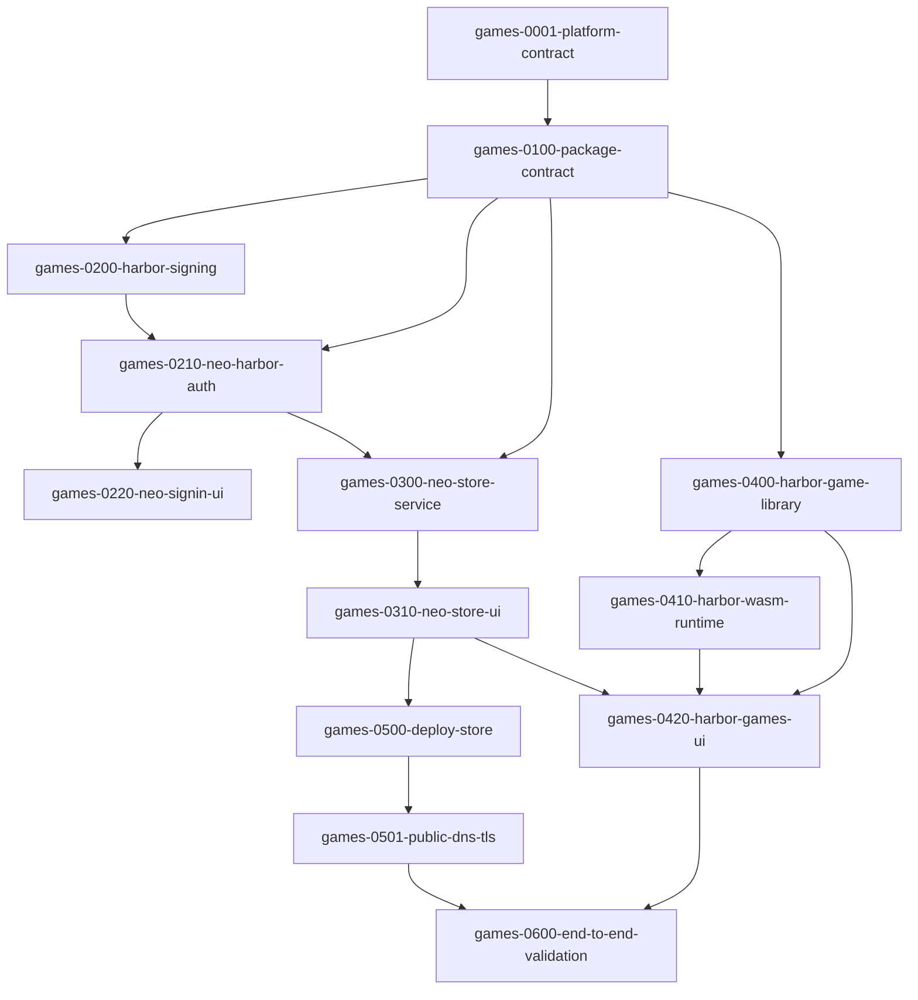

# Harbor games implementation graph

Source contract: [source-spec.md](source-spec.md)

## Repository ownership

| Work item                          | Repository                               |
| ---------------------------------- | ---------------------------------------- |
| `games-0001-platform-contract`     | Harbor                                   |
| `games-0100-package-contract`      | Neo Grounds, with Harbor golden fixtures |
| `games-0200-harbor-signing`        | Harbor                                   |
| `games-0210-neo-harbor-auth`       | Neo Grounds                              |
| `games-0220-neo-signin-ui`         | Neo Grounds                              |
| `games-0300-neo-store-service`     | Neo Grounds                              |
| `games-0310-neo-store-ui`          | Neo Grounds                              |
| `games-0400-harbor-game-library`   | Harbor                                   |
| `games-0410-harbor-wasm-runtime`   | Harbor                                   |
| `games-0420-harbor-games-ui`       | Harbor                                   |
| `games-0500-deploy-store`          | Neo Grounds and `gx10` operations        |
| `games-0501-public-dns-tls`        | Operator-controlled DNS and `gx10`       |
| `games-0600-end-to-end-validation` | Both repositories and deployed service   |

Multiplayer is intentionally absent from this graph. It requires a separate contract after the local runtime and distribution path pass acceptance.
